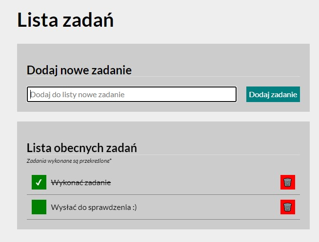

# Bartlomiej Snochowski - To Do List

## Demo

https://xxfino.github.io/ToDoList/

## Description

This is the website that can be used as a for example notebook. You can write here things that You want to do in a day, week, month, etc. We can mark which things 
we have already done and also We can remove something if we don't want to do it or if we already did it. 

In my website I used this technologies:
- HTML
- CSS
- Java Script
- Grid
- Media queries

This is how my site looks like: 

